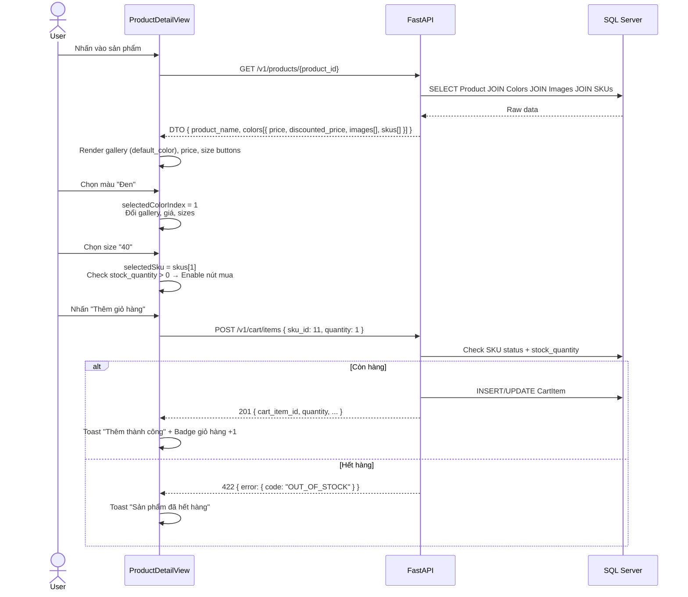
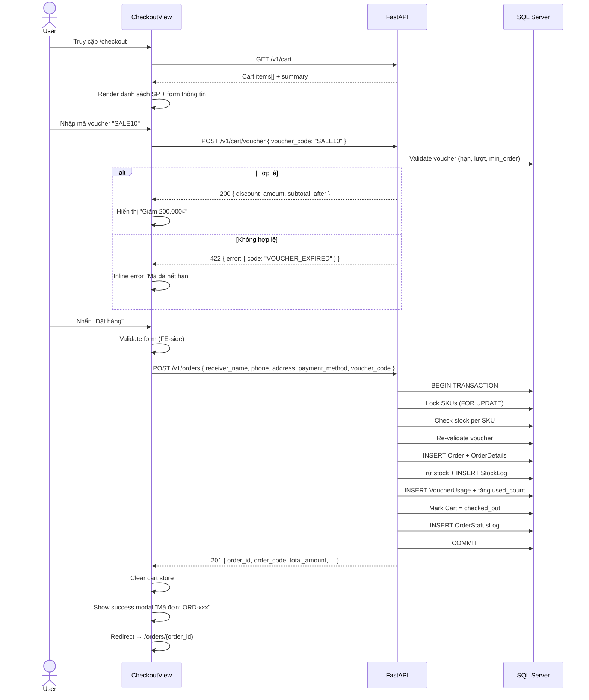
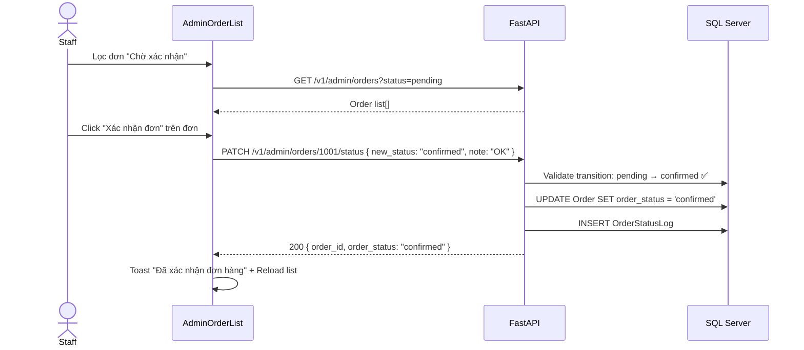
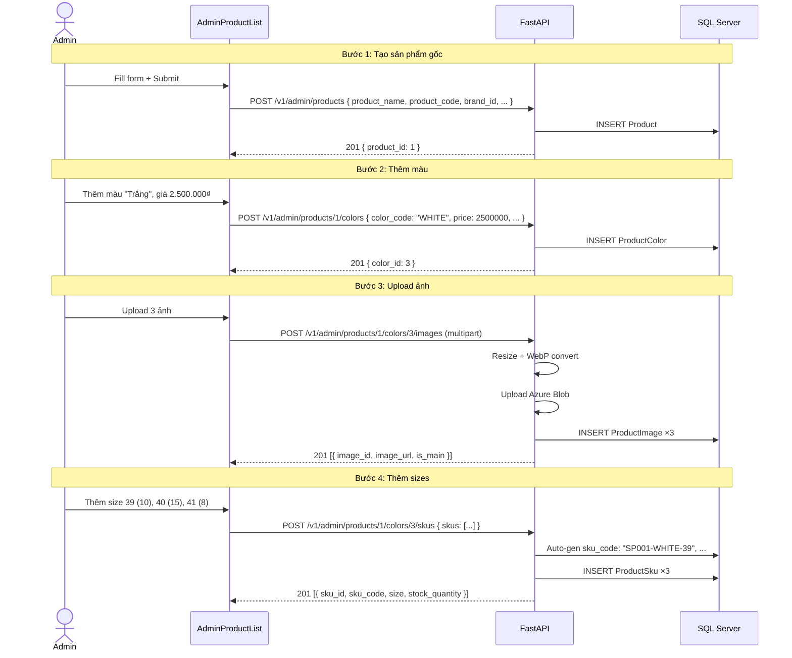

# TÀI LIỆU TÍCH HỢP FRONTEND – BACKEND (FE-BE Contract Specification)

> Phiên bản: 1.0 | Ngày: 28/06/2026  
> Tài liệu tham chiếu: [business_design.md](./business_design.md) | [database_design.md](./database_design.md) | [api_design.md](./api_design.md) | [backend_design.md](./backend_design.md) | [frontend_map.md](../FE_ShoeShop/frontend_map.md)

---

## MỤC LỤC
- [1. TỔNG QUAN HỆ THỐNG](#1-tổng-quan-hệ-thống)
- [2. DANH SÁCH USER FLOWS](#2-danh-sách-user-flows)
- [3. FE-BE CONTRACT CHI TIẾT THEO MÀN HÌNH](#3-fe-be-contract-chi-tiết-theo-màn-hình)
- [4. DATA MAPPING TỔNG HỢP (DB → BE DTO → FE)](#4-data-mapping-tổng-hợp-db--be-dto--fe)
- [5. STATE HANDLING TOÀN HỆ THỐNG](#5-state-handling-toàn-hệ-thống)
- [6. ERROR HANDLING & VALIDATION RULES](#6-error-handling--validation-rules)
- [7. AUTHENTICATION & PERMISSION FLOW](#7-authentication--permission-flow)
- [8. SEQUENCE DIAGRAMS — CÁC LUỒNG QUAN TRỌNG](#8-sequence-diagrams--các-luồng-quan-trọng)
- [9. CÁC THAY ĐỔI CẦN THỰC HIỆN KHI TÍCH HỢP](#9-các-thay-đổi-cần-thực-hiện-khi-tích-hợp)

---

## 1. TỔNG QUAN HỆ THỐNG

### 1.1 Kiến trúc tổng thể

```
┌──────────────────────────────────┐
│          FRONTEND (Vue 3)        │
│  Views → Stores → API Services  │
└────────────┬─────────────────────┘
             │ HTTP / REST / JSON
             │ JWT Bearer Token
┌────────────▼─────────────────────┐
│         BACKEND (FastAPI)        │
│  Routers → Services → Repos     │
└────────────┬─────────────────────┘
             │ SQLAlchemy ORM
┌────────────▼─────────────────────┐
│       DATABASE (SQL Server)      │
│  19 bảng quan hệ                │
└──────────────────────────────────┘
```

### 1.2 Nguyên tắc tích hợp

| Nguyên tắc | Mô tả |
|---|---|
| **FE không biết DB** | FE chỉ làm việc với DTO (response JSON từ API), không bao giờ ánh xạ trực tiếp cấu trúc bảng DB |
| **Response Envelope** | Mọi response đều theo cấu trúc `{ success, data, message }` hoặc `{ success, data, pagination }` |
| **Stateless Auth** | JWT token gửi qua header `Authorization: Bearer <token>` |
| **Error Code chuẩn** | Lỗi nghiệp vụ trả về `{ success: false, error: { code, message, details } }` |
| **Phân tầng FE** | UI Component → Pinia Store → API Service (`src/services/*.ts`) → axios HTTP |

### 1.3 Tầng API Service trên Frontend (cần bổ sung)

Hiện tại FE dùng mock data trực tiếp. Khi tích hợp BE, cần tạo tầng `src/services/` làm trung gian:

```
src/services/
├── api.ts              # axios instance, interceptors, base URL
├── auth.service.ts     # login, register, refresh, logout
├── brand.service.ts
├── category.service.ts
├── product.service.ts  # getProducts, getProductDetail
├── cart.service.ts     # getCart, addItem, updateItem, removeItem, applyVoucher
├── order.service.ts    # createOrder, getOrders, getOrderDetail, cancelOrder, createReturn
├── admin/
│   ├── product.service.ts
│   ├── order.service.ts
│   ├── voucher.service.ts
│   ├── report.service.ts
│   └── stock.service.ts
```

---

## 2. DANH SÁCH USER FLOWS

### 2.1 Bản đồ luồng người dùng

| # | User Flow | Vai trò | Trang UI (View) | API Endpoints |
|---|---|---|---|---|
| F01 | Đăng ký tài khoản | 🌐 Public | *(chưa có view)* | `POST /v1/auth/register` |
| F02 | Đăng nhập khách hàng | 🌐 Public | *(chưa có view)* | `POST /v1/auth/login` |
| F03 | Đăng nhập Admin/Staff | 🌐 Public | *(chưa có view)* | `POST /v1/auth/admin/login` |
| F04 | Xem trang chủ | 🌐 Public | `HomeView.vue` | `GET /v1/products?sort_by=sold_quantity`, `GET /v1/products?sort_by=created_at` |
| F05 | Tìm kiếm & lọc sản phẩm | 🌐 Public | `ProductListView.vue` | `GET /v1/products?keyword=&brand_id=&...` |
| F06 | Xem chi tiết sản phẩm | 🌐 Public | `ProductDetailView.vue` | `GET /v1/products/{product_id}` |
| F07 | Quản lý giỏ hàng | 🌐 Public | `CartDrawer.vue` | `GET /v1/cart`, `POST /v1/cart/items`, `PATCH /v1/cart/items/{id}`, `DELETE /v1/cart/items/{id}` |
| F08 | Áp dụng voucher | 🌐 Public | `CheckoutView.vue` | `POST /v1/cart/voucher`, `DELETE /v1/cart/voucher` |
| F09 | Thanh toán & đặt hàng | 🌐/👤 | `CheckoutView.vue` | `POST /v1/cart/checkout-preview`, `POST /v1/orders` |
| F10 | Xem lịch sử đơn hàng | 👤 Customer | `OrderHistoryView.vue` | `GET /v1/orders?status=&page=&limit=` |
| F11 | Xem chi tiết đơn hàng | 👤 Customer | `OrderDetailView.vue` | `GET /v1/orders/{order_id}` |
| F12 | Hủy đơn hàng | 👤 Customer | `OrderDetailView.vue` | `PATCH /v1/orders/{order_id}/cancel` |
| F13 | Yêu cầu đổi/trả hàng | 👤 Customer | `OrderDetailView.vue` | `POST /v1/orders/{order_id}/returns` |
| F14 | Admin — Dashboard | 👷 Staff | `AdminDashboardView.vue` | `GET /v1/admin/reports/revenue`, `/inventory`, `/best-sellers`, `/vouchers` |
| F15 | Admin — Quản lý sản phẩm | 🔑 Admin | `AdminProductListView.vue` | `GET/POST /v1/admin/products`, colors, images, skus |
| F16 | Admin — Quản lý đơn hàng | 👷 Staff | `AdminOrderListView.vue` | `GET /v1/admin/orders`, `PATCH .../status`, `PATCH .../cancel` |
| F17 | Admin — Quản lý đổi trả | 👷 Staff | `AdminOrderListView.vue` | `GET /v1/admin/returns`, `PATCH .../review`, `PATCH .../complete` |
| F18 | Admin — Quản lý voucher | 🔑 Admin | `AdminVoucherListView.vue` | `GET/POST /v1/admin/vouchers`, `PATCH .../status` |
| F19 | Admin — Cập nhật tồn kho | 👷 Staff | `AdminProductListView.vue` | `PATCH /v1/admin/skus/{id}/stock`, `GET .../stock-logs` |

---

## 3. FE-BE CONTRACT CHI TIẾT THEO MÀN HÌNH

---

### 3.1 HomeView.vue — Trang chủ

**API cần gọi:**

| Mục đích | API | Gọi khi nào |
|---|---|---|
| Sản phẩm nổi bật (Hot) | `GET /v1/products?sort_by=sold_quantity&sort_order=desc&limit=8` | `onMounted` |
| Sản phẩm mới về | `GET /v1/products?sort_by=created_at&sort_order=desc&limit=8` | `onMounted` |
| Danh sách thương hiệu | `GET /v1/brands` | `onMounted` |

**Data Mapping (API Response DTO → UI Component):**

| API Field (DTO) | UI Component | Hiển thị | Khi null/thiếu |
|---|---|---|---|
| `product_id` | `ProductCard.vue` | Dùng cho `:key` và `router-link` | Không render card |
| `product_name` | Card title | Text truncate 2 dòng | Hiển thị "—" |
| `brand_name` | Card subtitle | Text nhỏ | Ẩn |
| `default_color.main_image_url` | Card image `` | Ảnh 1:1 ratio | Hiển thị ảnh placeholder |
| `default_color.price` | Giá gốc | Format VNĐ, gạch ngang nếu có giảm giá | Không render |
| `default_color.discounted_price` | Giá sau giảm | Format VNĐ, font bold đỏ | Bằng giá gốc |
| `default_color.discount_type` | Badge giảm giá | `-10%` hoặc `-50.000₫` | Ẩn badge |
| `has_stock` | Badge tồn kho | Nếu `false` → "Hết hàng" (badge xám) | Mặc định `true` |

> **Lưu ý:** API `GET /v1/products` trả về DTO đã flatten: không trả toàn bộ `colors[]` mà chỉ trả `default_color` (đã JOIN `is_default=1`). FE không cần biết cấu trúc DB 3 cấp ở trang danh sách.

**UI States:**

| State | Điều kiện | FE hiển thị |
|---|---|---|
| `loading` | Đang fetch API | Skeleton shimmer effect trên ProductCard grid |
| `success` | API 200, `data.length > 0` | Render grid sản phẩm |
| `empty` | API 200, `data.length === 0` | Ẩn section, hoặc "Chưa có sản phẩm nào" |
| `error` | API 4xx/5xx hoặc timeout | Toast lỗi; retry button |

---

### 3.2 ProductListView.vue — Danh sách & Bộ lọc sản phẩm

**API:**

```
GET /v1/products?keyword={search}&brand_id={}&category_id={}&color_name={}
    &size={}&min_price={}&max_price={}&in_stock=true&on_sale=true
    &gender_target={}&page=1&limit=20&sort_by=price&sort_order=asc
```

**Filter UI → Query Params Mapping:**

| Filter UI Component | Query Param | Giá trị | Ghi chú |
|---|---|---|---|
| Search bar (Header) | `keyword` | `string` | Từ `route.query.search` |
| Brand buttons | `brand_id` | `number` | Hoặc `route.query.brand` (brand_name) → FE cần convert sang brand_id |
| Category select | `category_id` | `number` | Cần gọi `GET /v1/categories` trước để lấy danh sách |
| Color filter chips | `color_name` | `string` | Ví dụ: "Trắng", "Đen" |
| Size filter chips | `size` | `string` | Ví dụ: "39", "40" |
| Price range slider | `min_price`, `max_price` | `number` (VNĐ) | |
| Toggle "Còn hàng" | `in_stock` | `true` | Chỉ gửi khi checked |
| Toggle "Đang giảm giá" | `on_sale` | `true` | Chỉ gửi khi checked |
| Gender radio | `gender_target` | `men`/`women`/`unisex`/`kids` | |
| Sort dropdown | `sort_by` + `sort_order` | Ví dụ: `price` + `asc` | |
| Pagination | `page`, `limit` | default `1`, `20` | |

**Sortable Fields:**

| Field UI | `sort_by` value | Mặc định |
|---|---|---|
| Mới nhất | `created_at` | ✅ Default `desc` |
| Giá tăng dần | `price` + `asc` | |
| Giá giảm dần | `price` + `desc` | |
| Bán chạy | `sold_quantity` + `desc` | |

**Response DTO → ProductCard Mapping:** *(giống mục 3.1)*

**Pagination Handling:**

```typescript
// FE đọc từ response.pagination
interface PaginationMeta {
  page: number;       // Trang hiện tại
  limit: number;      // Số item/trang
  total_items: number; // Tổng số sản phẩm matching filter
  total_pages: number; // Tổng số trang
}
// Hiển thị: "Hiện 1-20 trên 85 sản phẩm" + nút trang
```

**UI States:**

| State | Xử lý |
|---|---|
| `loading` | Skeleton grid 6 cards (hoặc overlay spinner trên grid hiện tại) |
| `success` | Render grid + pagination |
| `empty` | Màn hình empty state: icon tìm kiếm + "Không tìm thấy sản phẩm" + nút "Thiết lập lại bộ lọc" |
| `error` | Banner lỗi phía trên grid + retry |

---

### 3.3 ProductDetailView.vue — Chi tiết sản phẩm

**API:**

```
GET /v1/products/{product_id}
```

**Response DTO → UI Mapping:**

| API Field Path | UI Element | Hiển thị | Khi null |
|---|---|---|---|
| `product_name` | `<h1>` | Tên sản phẩm | Redirect 404 |
| `brand.brand_name` | Breadcrumb + subtitle | "Nike" | "—" |
| `category.category_name` | Breadcrumb | "Giày thể thao" | Ẩn |
| `description` | Tab mô tả | Rich text | "Chưa có mô tả" |
| `gender_target` | Badge | "Nam" / "Nữ" / "Unisex" | Ẩn |
| `colors[]` | Color selector (dots/swatches) | Danh sách nút chọn màu | Phải có ≥1 màu |
| `colors[i].color_name` | Tooltip trên color dot | "Trắng" | Hiển thị color_code |
| `colors[i].hex_code` | `background-color` của dot | `#FFFFFF` | Dùng màu mặc định `#ccc` |
| `colors[i].price` | Giá gốc | `2.500.000₫` (gạch ngang nếu có giảm) | — |
| `colors[i].discounted_price` | Giá sau giảm | `2.250.000₫` | Bằng price |
| `colors[i].discount_type/value` | Badge giảm giá | `-10%` | Ẩn badge |
| `colors[i].images[]` | Gallery ảnh | Thumbnail + main image | Ảnh placeholder |
| `colors[i].images[j].is_main` | Ảnh mặc định hiển thị | Ảnh đầu tiên | Ảnh index 0 |
| `colors[i].skus[]` | Size selector (buttons) | Danh sách nút size | "Không có size" |
| `colors[i].skus[j].size` | Text trên nút size | "39", "40" | — |
| `colors[i].skus[j].stock_quantity` | Trạng thái nút size | `> 0`: kích hoạt, `=== 0`: disabled + "Hết hàng" | Disabled |
| `colors[i].skus[j].status` | Visibility | `discontinued`: ẩn hoàn toàn nút đó | — |

**Tương tác (Interaction Flow):**

```
Chọn màu (click color dot)
  → FE set selectedColorIndex = i
  → UI đổi: gallery ảnh, giá, badge giảm giá, danh sách size
  → Reset selectedSku = null
  → Nút "Thêm giỏ hàng" disabled cho đến khi chọn size

Chọn size (click size button)
  → FE set selectedSku = skus[j]
  → Kiểm tra:
      - stock_quantity > 0 → enable nút "Thêm giỏ hàng" + "Mua ngay"
      - stock_quantity === 0 → disable, text "Hết hàng"
  → Hiển thị "Còn {stock_quantity} sản phẩm"

Nhấn "Thêm giỏ hàng"
  → Gọi POST /v1/cart/items { sku_id, quantity }
  → Success: toast thông báo + cập nhật badge giỏ hàng
  → Error OUT_OF_STOCK: toast lỗi "Sản phẩm đã hết hàng"
  → Error QUANTITY_EXCEEDS_STOCK: toast lỗi + hiển thị số lượng tối đa
```

**discounted_price không có trong DTO gốc — BE cần tính sẵn:**

```
discounted_price = 
  if discount_type == 'percent': price * (1 - discount_value/100)
  if discount_type == 'fixed':   price - discount_value
  if discount_type == 'none':    price
```

> **Contract:** BE trả thêm field `discounted_price` (computed) trong mỗi `color` object. FE không cần tự tính.

---

### 3.4 CartDrawer.vue + Cart Handling — Giỏ hàng

**APIs:**

| Hành động | API | Request | Response DTO |
|---|---|---|---|
| Xem giỏ | `GET /v1/cart` | Header: `Authorization` hoặc `X-Session-Id` | `{ cart_id, items[], summary }` |
| Thêm item | `POST /v1/cart/items` | `{ sku_id, quantity }` | `{ cart_item_id, sku_id, quantity, ... }` |
| Sửa số lượng | `PATCH /v1/cart/items/{cart_item_id}` | `{ quantity }` | Updated item |
| Xóa item | `DELETE /v1/cart/items/{cart_item_id}` | — | 200 OK |
| Xóa toàn bộ | `DELETE /v1/cart` | — | 200 OK |

**Cart Item DTO → CartDrawer UI Mapping:**

| API Response Field | UI Element | Hiển thị | Khi null/thiếu |
|---|---|---|---|
| `cart_item_id` | Internal key | Dùng cho update/delete API | — |
| `product_name` | Tên sản phẩm | Text | "Sản phẩm không xác định" |
| `color_name` | Chi tiết | "Màu: Trắng" | Ẩn |
| `size` | Chi tiết | "Size: 40" | Ẩn |
| `image_url` | Thumbnail | Ảnh nhỏ 60×60 | Ảnh placeholder |
| `quantity` | Số lượng selector (+/-) | Số hiện tại | — |
| `discounted_price` | Đơn giá hiển thị | Format VNĐ | Dùng `unit_price` |
| `line_total` | Thành tiền | `discounted_price × quantity` | Tự tính FE |
| `stock_quantity` | Giới hạn nút + | Max cho input | Nếu thiếu, max = 99 |
| `is_available` | Trạng thái dòng | `false` → banner cảnh báo "Sản phẩm đã hết hàng hoặc ngừng bán" + nút xóa | Mặc định `true` |

**Chuyển đổi Store:**

Khi tích hợp BE, `stores/cart.ts` sẽ chuyển từ `localStorage` sang gọi API:

```typescript
// TRƯỚC (mock — localStorage)
addToCart(product, color, sku, quantity) → push to this.items

// SAU (tích hợp BE)
async addToCart(skuId: number, quantity: number) {
  const { data } = await cartService.addItem({ sku_id: skuId, quantity });
  // Reload cart từ server
  await this.fetchCart();
}
```

---

### 3.5 CheckoutView.vue — Thanh toán & Đặt hàng

**APIs theo thứ tự gọi:**

```
① GET /v1/cart                           → Lấy giỏ hàng hiện tại
② POST /v1/cart/voucher                  → Áp voucher (tùy chọn)
③ POST /v1/cart/checkout-preview         → Preview tổng tiền
④ POST /v1/orders                        → Xác nhận đặt hàng
```

**Form Input → API Request Mapping (Tạo đơn hàng):**

| Form Field | Validation (FE) | API Field | Validation (BE) |
|---|---|---|---|
| Họ tên người nhận * | Required, max 150 ký tự | `receiver_name` | `@IsNotEmpty`, `@MaxLength(150)` |
| Số điện thoại * | Required, format VN (10 chữ số) | `receiver_phone` | `@IsPhoneNumber('VN')` |
| Địa chỉ giao hàng * | Required, max 500 ký tự | `shipping_address` | `@IsNotEmpty`, `@MaxLength(500)` |
| Ghi chú | Optional, max 1000 ký tự | `note` | `@IsOptional`, `@MaxLength(1000)` |
| Phương thức thanh toán * | Required radio: `cod` / `bank_transfer` | `payment_method` | `@IsEnum(PaymentMethod)` |
| Phương thức giao hàng | `standard` / `express` | `shipping_method` | `@IsOptional` |
| Mã voucher | Optional | `voucher_code` | `@IsOptional`, `@MaxLength(50)` |

**Checkout Preview DTO → UI Bảng Tóm tắt:**

| API Field | UI Element | Format |
|---|---|---|
| `items[]` | Danh sách sản phẩm | Ảnh + tên + màu/size + SL × đơn giá |
| `subtotal` | "Tạm tính" | Format VNĐ |
| `voucher_discount` | "Giảm giá (mã SALE10)" | `- xx.xxx₫` (màu xanh lá) |
| `shipping_fee` | "Phí vận chuyển" | Format VNĐ, hoặc "Miễn phí" nếu = 0 |
| `total_amount` | "Tổng thanh toán" | Format VNĐ, font bold lớn |

**Error Handling khi đặt hàng (POST /v1/orders):**

| Error Code (BE) | HTTP | UI Handling |
|---|---|---|
| `CART_EMPTY` | 422 | Redirect về trang chủ + toast "Giỏ hàng trống" |
| `OUT_OF_STOCK` | 422 | Modal cảnh báo: liệt kê SKU hết hàng + nút "Quay lại giỏ" |
| `QUANTITY_EXCEEDS_STOCK` | 422 | Modal: "SKU X chỉ còn Y sản phẩm" + nút điều chỉnh |
| `VOUCHER_EXPIRED` | 422 | Toast: "Mã giảm giá đã hết hạn" + xóa voucher trên UI |
| `VOUCHER_USAGE_EXCEEDED` | 422 | Toast: "Mã giảm giá đã hết lượt sử dụng" |
| `VOUCHER_MIN_ORDER_NOT_MET` | 422 | Toast: "Đơn hàng chưa đạt giá trị tối thiểu xxx₫" |
| `ORDER_INFO_MISSING` | 400 | Highlight field thiếu trên form |
| Network error / 500 | — | Toast: "Đã xảy ra lỗi, vui lòng thử lại" + enable nút submit lại |

**Sau khi đặt hàng thành công:**

```
POST /v1/orders → 201 Created
  → Hiển thị modal/page xác nhận:
      "Đặt hàng thành công! Mã đơn: ORD-20260628-1001"
  → Clear cart store
  → Router redirect: /orders/{order_id}
```

---

### 3.6 OrderHistoryView.vue — Lịch sử đơn hàng

**API:**

```
GET /v1/orders?status={filter}&page=1&limit=20
```

**Tab Filter → Query Param:**

| Tab UI | `status` param | Mô tả |
|---|---|---|
| Tất cả | *(không gửi)* | Tất cả đơn |
| Chờ xác nhận | `pending` | Đơn mới |
| Đã xác nhận | `confirmed` | Đã xác nhận |
| Đang giao | `shipping` | Đang vận chuyển |
| Hoàn thành | `completed` | Đã giao |
| Đã hủy | `cancelled` | Đơn bị hủy |

**Order List DTO → UI Card Mapping:**

| API Field | UI Element | Format | Khi null |
|---|---|---|---|
| `order_code` | Card header | `#ORD-20260628-1001` | — |
| `order_status` | Badge trạng thái | Dịch sang tiếng Việt + color code | — |
| `total_amount` | Tổng tiền | Format VNĐ | `0₫` |
| `item_count` | Số lượng SP | "2 sản phẩm" | "0 sản phẩm" |
| `created_at` | Ngày đặt | `DD/MM/YYYY HH:mm` | — |

**Status Badge Color Mapping:**

| `order_status` | Label tiếng Việt | Badge Color |
|---|---|---|
| `pending` | Chờ xác nhận | `bg-yellow-100 text-yellow-800` |
| `confirmed` | Đã xác nhận | `bg-blue-100 text-blue-800` |
| `preparing` | Đang chuẩn bị | `bg-indigo-100 text-indigo-800` |
| `shipping` | Đang giao hàng | `bg-purple-100 text-purple-800` |
| `completed` | Hoàn thành | `bg-emerald-100 text-emerald-800` |
| `cancelled` | Đã hủy | `bg-rose-100 text-rose-800` |

---

### 3.7 OrderDetailView.vue — Chi tiết đơn hàng

**API:**

```
GET /v1/orders/{order_id}
```

**Full DTO → UI Section Mapping:**

| Section UI | API Fields | Chi tiết |
|---|---|---|
| **Header** | `order_code`, `order_status`, `created_at` | Mã đơn + badge trạng thái + ngày đặt |
| **Timeline** | `status_history[]` | Mỗi item: `new_status` (dịch) + `changed_at` + `note` |
| **Thông tin nhận hàng** | `receiver_name`, `receiver_phone`, `shipping_address`, `note` | Card info |
| **Phương thức** | `payment_method`, `payment_status` | "COD" / "Chuyển khoản" + badge thanh toán |
| **Danh sách SP** | `items[]` | Bảng: ảnh + tên + màu/size + SL + đơn giá + thành tiền |
| **Tổng kết** | `subtotal_amount`, `voucher_discount_amount`, `voucher_code_snapshot`, `shipping_fee`, `total_amount` | Bảng tóm tắt thanh toán |

**OrderDetail Item Snapshot DTO → UI Table Row:**

| API Field | UI Column | Format | Ghi chú |
|---|---|---|---|
| `image_url_snapshot` | Ảnh sản phẩm | 60×60 thumbnail | Placeholder nếu null |
| `product_name_snapshot` | Tên sản phẩm | Text | — |
| `color_name_snapshot` | Màu | "Trắng" | — |
| `size_snapshot` | Size | "40" | — |
| `quantity` | SL | Số | — |
| `unit_price` | Giá gốc | Format VNĐ, gạch ngang nếu có giảm | — |
| `discounted_price` | Giá sau giảm | Format VNĐ | — |
| `line_total` | Thành tiền | Format VNĐ, bold | `discounted_price × quantity` |

> **Lưu ý Snapshot**: Các field `*_snapshot` là giá trị **đông cứng tại thời điểm đặt hàng**. Nếu admin thay đổi tên/giá sản phẩm sau đó, đơn hàng vẫn hiển thị đúng thông tin cũ. FE luôn dùng snapshot, KHÔNG gọi API sản phẩm để lấy dữ liệu bổ sung.

**Hành động theo trạng thái đơn:**

| `order_status` | Nút hành động hiển thị | API gọi |
|---|---|---|
| `pending` | "Hủy đơn hàng" | `PATCH /v1/orders/{id}/cancel` |
| `confirmed` | "Hủy đơn hàng" | `PATCH /v1/orders/{id}/cancel` |
| `preparing` | "Hủy đơn hàng" | `PATCH /v1/orders/{id}/cancel` |
| `shipping` | *(không có nút)* | — |
| `completed` | "Yêu cầu đổi/trả hàng" | `POST /v1/orders/{id}/returns` |
| `cancelled` | *(không có nút)* | — |

**Return Request Form → API:**

```typescript
// POST /v1/orders/{order_id}/returns
{
  request_type: "exchange" | "refund",
  reason: "wrong_size" | "wrong_color" | "defective" | "wrong_item" | "other",
  reason_note?: string,
  items: [
    {
      original_sku_id: number,
      exchange_sku_id?: number,   // Chỉ khi type = "exchange"
      quantity: number
    }
  ]
}
```

---

### 3.8 AdminDashboardView.vue — Bảng điều khiển quản trị

**APIs:**

| Section | API | Params |
|---|---|---|
| Thẻ thống kê | `GET /v1/admin/reports/revenue` | `from_date`, `to_date` |
| Cảnh báo tồn kho | `GET /v1/admin/reports/inventory` | `low_stock_threshold=5` |
| Sản phẩm bán chạy | `GET /v1/admin/reports/best-sellers` | `limit=10` |
| Hiệu quả voucher | `GET /v1/admin/reports/vouchers` | `from_date`, `to_date` |

**Revenue Summary DTO → Stats Cards:**

| API Field | Card UI | Format |
|---|---|---|
| `summary.total_revenue` | "Doanh thu" | Format VNĐ, font lớn |
| `summary.total_orders` | "Tổng đơn hàng" | Số |
| `summary.average_order_value` | "Giá trị TB/đơn" | Format VNĐ |

**Inventory Report DTO → Cảnh báo tồn kho thấp:**

| API Field | UI | Hiển thị |
|---|---|---|
| `product_name` | Tên SP | Text |
| `color_name` | Màu | Text |
| `size` | Size | Text |
| `sku_code` | Mã SKU | Mono font |
| `stock_quantity` | Tồn kho | Badge đỏ nếu `< 5` |

---

### 3.9 AdminProductListView.vue — Quản lý sản phẩm

**APIs theo tương tác:**

| Hành động UI | API | Body |
|---|---|---|
| Load danh sách | `GET /v1/admin/products?page=&limit=&status=` | — |
| Tạo sản phẩm gốc | `POST /v1/admin/products` | `{ product_name, product_code, brand_id, category_id, description, gender_target }` |
| Thêm màu | `POST /v1/admin/products/{id}/colors` | `{ color_code, color_name, hex_code, price, discount_type, discount_value, is_default }` |
| Upload ảnh | `POST /v1/admin/products/{id}/colors/{cid}/images` | `multipart/form-data` images[] |
| Thêm sizes/SKU | `POST /v1/admin/products/{id}/colors/{cid}/skus` | `{ skus: [{ size, stock_quantity }] }` |
| Cập nhật giá | `PATCH /v1/admin/products/{id}/colors/{cid}/pricing` | `{ price, discount_type, discount_value }` |
| Cập nhật kho | `PATCH /v1/admin/skus/{sku_id}/stock` | `{ change_quantity, reason, reason_note }` |
| Xem log kho | `GET /v1/admin/skus/{sku_id}/stock-logs` | — |
| Ẩn sản phẩm | `PATCH /v1/admin/products/{id}/status` | `{ status: "hidden" }` |

**Product List Table Columns:**

| Column | API Field | Sortable | Filterable | Khi null |
|---|---|---|---|---|
| Mã SP | `product_code` | ❌ | ❌ | — |
| Tên sản phẩm | `product_name` | ✅ | Keyword search | — |
| Thương hiệu | `brand_name` | ❌ | ✅ Dropdown | — |
| Số màu | `colors.length` | ❌ | ❌ | "0" |
| Tổng tồn kho | *(aggregated)* | ❌ | ❌ | "0" |
| Trạng thái | `status` | ❌ | ✅ Dropdown | — |
| Hành động | — | — | — | Nút: Xem / Sửa / Ẩn |

**Stock Adjustment Form → API:**

```typescript
// PATCH /v1/admin/skus/{sku_id}/stock
{
  change_quantity: 50,      // Dương = nhập, Âm = xuất/điều chỉnh giảm
  reason: "import",         // "import" | "adjustment"
  reason_note: "Nhập hàng tháng 7/2026"
}

// Response
{
  sku_id: 10,
  sku_code: "SP001-WHITE-001-39",
  stock_before: 5,
  stock_after: 55,
  change_quantity: 50
}
```

---

### 3.10 AdminOrderListView.vue — Quản lý đơn hàng

**API:**

```
GET /v1/admin/orders?status={}&order_code={}&phone={}
    &from_date={}&to_date={}&page=1&limit=20
```

**Order Table Columns:**

| Column | API Field | Sortable | Format |
|---|---|---|---|
| Mã đơn | `order_code` | ❌ | Mono font |
| Khách hàng | `receiver_name` | ❌ | Text |
| SĐT | `receiver_phone` | ❌ | Text |
| Tổng tiền | `total_amount` | ✅ | Format VNĐ |
| Trạng thái | `order_status` | ❌ | Badge (xem bảng color mục 3.6) |
| Thanh toán | `payment_method` | ❌ | "COD" / "CK" / "Online" |
| Ngày đặt | `created_at` | ✅ (default) | `DD/MM/YYYY HH:mm` |
| Hành động | — | — | Nút: Xem chi tiết / Chuyển trạng thái / Hủy |

**Status Transition UI:**

```
Nút "Xác nhận đơn" (khi pending)
  → PATCH /v1/admin/orders/{id}/status { new_status: "confirmed" }
  → Toast success → Reload bảng

Nút "Đang chuẩn bị" (khi confirmed)
  → PATCH /v1/admin/orders/{id}/status { new_status: "preparing" }

Nút "Đang giao hàng" (khi preparing)
  → PATCH /v1/admin/orders/{id}/status { new_status: "shipping" }

Nút "Hoàn thành" (khi shipping)
  → PATCH /v1/admin/orders/{id}/status { new_status: "completed" }

Nút "Hủy đơn" (khi pending/confirmed/preparing)
  → Modal nhập lý do → PATCH /v1/admin/orders/{id}/cancel { reason: "..." }
```

**Return Management (cùng trang):**

```
GET /v1/admin/returns?status=pending

Tab "Yêu cầu đổi trả" hiển thị bảng:
| Mã đơn gốc | Loại (Đổi/Trả) | Lý do | Ngày yêu cầu | Trạng thái | Hành động |

Nút "Duyệt":
  → PATCH /v1/admin/returns/{id}/review { status: "approved", note: "..." }

Nút "Từ chối":
  → PATCH /v1/admin/returns/{id}/review { status: "rejected", note: "..." }

Nút "Hoàn tất" (sau khi approved):
  → PATCH /v1/admin/returns/{id}/complete
  → BE tự động điều chỉnh kho + ghi StockLog
```

---

### 3.11 AdminVoucherListView.vue — Quản lý voucher

**APIs:**

| Hành động | API | Body |
|---|---|---|
| Load danh sách | `GET /v1/admin/vouchers?page=&limit=` | — |
| Tạo voucher | `POST /v1/admin/vouchers` | *(xem bảng dưới)* |
| Bật/tắt | `PATCH /v1/admin/vouchers/{id}/status` | `{ status: "paused" }` hoặc `{ status: "active" }` |
| Xem lịch sử dùng | `GET /v1/admin/vouchers/{id}/usages` | — |

**Create Voucher Form → API:**

| Form Field | API Field | Validation |
|---|---|---|
| Mã voucher * | `code` | Required, unique, uppercase |
| Phân loại * | `voucher_type` | `percent` / `fixed` / `free_shipping` |
| Giá trị giảm * | `discount_value` | > 0, nếu percent thì ≤ 100 |
| Giảm tối đa | `max_discount_amount` | Chỉ khi type = percent |
| Đơn tối thiểu * | `min_order_amount` | ≥ 0 |
| Tổng lượt dùng | `usage_limit` | null = vô hạn |
| Lượt/khách | `max_usage_per_customer` | Default 1 |
| Ngày bắt đầu | `start_date` | ISO 8601 |
| Ngày kết thúc | `end_date` | ISO 8601, > start_date |

**Voucher Table Columns:**

| Column | API Field | Format |
|---|---|---|
| Mã Voucher | `code` | Mono font, dashed border |
| Phân loại | `voucher_type` | "Giảm theo %" / "Giảm số tiền" / "Miễn ship" |
| Giá trị giảm | `discount_value` + `max_discount_amount` | "10%" hoặc "50.000₫"; kèm "Tối đa: 200.000₫" |
| Đơn tối thiểu | `min_order_amount` | Format VNĐ |
| Đã dùng/Giới hạn | `used_count` / `usage_limit` | "23 / 100" hoặc "23 / Vô hạn" |
| Thời hạn | `start_date`, `end_date` | "01/07 – 31/07/2026" |
| Trạng thái | `status` | Badge: xanh(active) / đỏ(paused) / xám(expired) |

---

## 4. DATA MAPPING TỔNG HỢP (DB → BE DTO → FE)

### 4.1 Nguyên tắc

```
DB Column (snake_case)
    ↓  SQLAlchemy Model
BE Entity
    ↓  Service tính toán / transform
BE DTO (Pydantic Schema → JSON)
    ↓  HTTP Response
FE Interface (TypeScript type)
    ↓  Reactive ref / computed
UI Component (Vue template)
```

> **Quy tắc vàng:** FE **KHÔNG BAO GIỜ** truy cập trực tiếp cấu trúc DB. Mọi dữ liệu FE nhận đều là DTO do BE tạo ra.

### 4.2 Mapping chi tiết: Sản phẩm

| DB Column | DB Table | BE DTO Field | FE Type Field | Ghi chú |
|---|---|---|---|---|
| `product_id` | Product | `product_id` | `product_id: number` | FE hiện dùng `string`, cần chuyển sang `number` |
| `product_code` | Product | `product_code` | `product_code: string` | — |
| `product_name` | Product | `product_name` | `product_name: string` | — |
| `brand_id` | Product | `brand.brand_name` | `brand_name: string` | **BE flatten**: FE nhận `brand_name`, không nhận `brand_id` (ở list) |
| `category_id` | Product | `category.category_name` | `category_name: string` | **BE flatten** |
| `price` | ProductColor | `colors[].price` | `color.price: number` | — |
| `discount_type` | ProductColor | `colors[].discount_type` | `color.discount_type` | — |
| *(computed)* | — | `colors[].discounted_price` | `color.discounted_price: number` | **BE tính sẵn**, FE không cần tính |
| `stock_quantity` | ProductSku | `colors[].skus[].stock_quantity` | `sku.stock_quantity: number` | — |
| *(computed)* | — | `default_color.*` | *(list view only)* | **BE flatten** cho trang list |
| *(computed)* | — | `has_stock` | `has_stock: boolean` | **BE tính**: ANY sku.stock > 0 |

### 4.3 Mapping chi tiết: Đơn hàng

| DB Column | DB Table | BE DTO Field | FE Type Field | Ghi chú |
|---|---|---|---|---|
| `order_id` | Order | `order_id` | `order_id: number` | FE hiện dùng `string` |
| `order_code` | Order | `order_code` | `order_code: string` | — |
| `subtotal_amount` | Order | `subtotal_amount` | `subtotal_amount: number` | — |
| `voucher_discount_amount` | Order | `voucher_discount_amount` | `voucher_discount_amount: number` | — |
| `shipping_fee` | Order | `shipping_fee` | `shipping_fee: number` | — |
| `total_amount` | Order | `total_amount` | `total_amount: number` | `= subtotal - voucher_discount + shipping_fee` |
| `product_name_snapshot` | OrderDetail | `items[].product_name_snapshot` | `item.product_name_snapshot: string` | **Snapshot — không bao giờ thay đổi** |
| `unit_price` | OrderDetail | `items[].unit_price` | `item.unit_price: number` | Giá gốc tại thời điểm mua |
| `discounted_price` | OrderDetail | `items[].discounted_price` | `item.discounted_price: number` | Giá sau giảm sản phẩm |

### 4.4 FE Type Changes khi tích hợp BE

Các ID hiện tại dùng `string` trong FE, cần chuyển sang `number` khi tích hợp:

| Field | Hiện tại (mock) | Sau tích hợp (BE) | Lý do |
|---|---|---|---|
| `product_id` | `string` | `number` | DB dùng `BIGINT AUTO_INCREMENT` |
| `color_id` | `string` | `number` | DB dùng `BIGINT` |
| `sku_id` | `string` | `number` | DB dùng `BIGINT` |
| `order_id` | `string` | `number` | DB dùng `BIGINT` |
| `voucher_id` | `string` | `number` | DB dùng `BIGINT` |
| `cart_item_id` | *(không có)* | `number` | BE quản lý ID |

---

## 5. STATE HANDLING TOÀN HỆ THỐNG

### 5.1 Mô hình trạng thái chung

Mọi trang FE khi gọi API đều phải xử lý 5 trạng thái:

```
idle → loading → success / empty / error
                    │
                    └→ partial_error (1 API lỗi trong nhiều API song song)
```

### 5.2 Composable chuẩn hóa

```typescript
// src/composables/useApiState.ts
interface ApiState<T> {
  data: T | null;
  isLoading: boolean;
  isError: boolean;
  errorMessage: string | null;
  errorCode: string | null;
  isEmpty: boolean;
}

function useApiState<T>() {
  const state = reactive<ApiState<T>>({ ... });

  async function execute(apiFn: () => Promise<T>) {
    state.isLoading = true;
    state.isError = false;
    try {
      const result = await apiFn();
      state.data = result;
      state.isEmpty = Array.isArray(result) ? result.length === 0 : !result;
    } catch (err) {
      state.isError = true;
      state.errorCode = err.response?.data?.error?.code;
      state.errorMessage = err.response?.data?.error?.message || 'Đã xảy ra lỗi';
    } finally {
      state.isLoading = false;
    }
  }
  return { ...toRefs(state), execute };
}
```

### 5.3 UI Pattern cho từng trạng thái

| State | UI Pattern | Component |
|---|---|---|
| `loading` | Skeleton shimmer (product grid), Spinner (button), Loading overlay (table) | `SkeletonCard.vue`, `SpinnerOverlay.vue` |
| `success` | Render dữ liệu bình thường | — |
| `empty` | Illustration + text + CTA button | `EmptyState.vue` |
| `error` | Toast notification hoặc inline error banner + retry button | `ErrorBanner.vue` |
| `partial_error` | Hiển thị dữ liệu có được + toast cảnh báo phần bị lỗi | — |

---

## 6. ERROR HANDLING & VALIDATION RULES

### 6.1 Error Response Envelope chuẩn

```json
{
  "success": false,
  "error": {
    "code": "OUT_OF_STOCK",
    "message": "Sản phẩm đã hết hàng",
    "details": { "sku_id": 123, "stock_quantity": 0 }
  }
}
```

### 6.2 Danh sách Error Codes và FE Handling

| Error Code | HTTP | Khi nào | FE xử lý |
|---|---|---|---|
| `UNAUTHORIZED` | 401 | Token hết hạn / thiếu | Redirect → trang login; clear auth state |
| `FORBIDDEN` | 403 | Không đủ quyền | Toast: "Bạn không có quyền thực hiện thao tác này" |
| `NOT_FOUND` | 404 | Resource không tồn tại | Redirect → 404 page |
| `PRODUCT_NAME_REQUIRED` | 400 | Tên SP trống | Highlight input + inline error |
| `DUPLICATE_COLOR_CODE` | 409 | Mã màu trùng | Modal thông báo |
| `DUPLICATE_SKU_CODE` | 409 | Mã SKU trùng | Modal thông báo |
| `DUPLICATE_VOUCHER_CODE` | 409 | Mã voucher trùng | Inline error dưới input |
| `CANNOT_DELETE_PRODUCT` | 422 | SP đã có đơn hàng | Toast cảnh báo |
| `INVALID_PRICE` | 400 | Giá ≤ 0 | Highlight input |
| `INVALID_DISCOUNT` | 400 | Giảm giá sai | Highlight input + thông báo |
| `OUT_OF_STOCK` | 422 | Hết hàng | Disable nút mua + badge "Hết hàng" |
| `QUANTITY_EXCEEDS_STOCK` | 422 | Vượt tồn kho | Toast + hiển thị max |
| `STOCK_CANNOT_BE_NEGATIVE` | 422 | Kho âm | Toast lỗi |
| `VOUCHER_NOT_FOUND` | 404 | Mã voucher sai | Inline error: "Mã giảm giá không tồn tại" |
| `VOUCHER_EXPIRED` | 422 | Hết hạn | Inline error: "Mã giảm giá đã hết hạn" |
| `VOUCHER_USAGE_EXCEEDED` | 422 | Hết lượt | Inline error: "Mã giảm giá đã hết lượt sử dụng" |
| `VOUCHER_MIN_ORDER_NOT_MET` | 422 | Đơn chưa đạt | Inline error: "Đơn hàng tối thiểu {min}₫" |
| `ORDER_INFO_MISSING` | 400 | Thiếu thông tin | Highlight field trên form |
| `ORDER_CANNOT_BE_CANCELLED` | 422 | Đơn không hủy được | Toast cảnh báo |
| `INVALID_STATUS_TRANSITION` | 422 | Chuyển trạng thái sai | Toast lỗi |
| `CART_EMPTY` | 422 | Giỏ rỗng | Redirect trang chủ |

### 6.3 Validation Rules hai tầng (FE + BE)

| Field | FE Validation (trước submit) | BE Validation (sau submit) |
|---|---|---|
| `receiver_name` | Required, max 150 chars | `@IsNotEmpty`, `@MaxLength(150)` |
| `receiver_phone` | Required, regex `/^0[0-9]{9}$/` | `@IsPhoneNumber('VN')` |
| `shipping_address` | Required, max 500 chars | `@IsNotEmpty`, `@MaxLength(500)` |
| `product_name` | Required, max 255 chars | `@IsNotEmpty`, `@MaxLength(255)` |
| `price` (Color) | Required, > 0 | `CHECK (price > 0)` |
| `discount_value` | ≥ 0, nếu percent thì ≤ 100 | `CHECK (discount_value >= 0)` |
| `stock_quantity` | Integer, ≥ 0 | `CHECK (stock_quantity >= 0)` |
| `voucher_code` | Uppercase, max 50 chars | `@MaxLength(50)`, UNIQUE check |

> **Nguyên tắc:** FE validate để UX tốt (phản hồi nhanh). BE validate để đảm bảo tính toàn vẹn dữ liệu (source of truth).

---

## 7. AUTHENTICATION & PERMISSION FLOW

### 7.1 Luồng xác thực

```
                      ┌─────────────────────────────────┐
                      │         FE Auth Store            │
                      │  accessToken, user, role         │
                      └───────┬─────────────────────────┘
                              │
        ┌─────────────────────┼───────────────────────┐
        │                     │                       │
   ┌────▼─────┐        ┌─────▼──────┐         ┌──────▼──────┐
   │  Login   │        │  API Call  │         │  Expired?   │
   │ Page     │        │ + Bearer   │         │  401 resp   │
   └────┬─────┘        └─────┬──────┘         └──────┬──────┘
        │                     │                       │
   POST /auth/login     Header:                 POST /auth/refresh
        │               Authorization:              │
        ▼               Bearer <token>              ▼
   Store token                               Cập nhật token
   + redirect                                 hoặc logout
```

### 7.2 Axios Interceptor chuẩn

```typescript
// src/services/api.ts
import axios from 'axios';
import { useAuthStore } from '@/stores/auth';
import router from '@/router';

const api = axios.create({
  baseURL: import.meta.env.VITE_API_BASE_URL || 'http://localhost:8000/v1',
  timeout: 10000,
});

// Request interceptor — gắn token
api.interceptors.request.use((config) => {
  const authStore = useAuthStore();
  if (authStore.accessToken) {
    config.headers.Authorization = `Bearer ${authStore.accessToken}`;
  }
  // Khách vãng lai: gắn session ID
  const sessionId = localStorage.getItem('session_id');
  if (sessionId && !authStore.accessToken) {
    config.headers['X-Session-Id'] = sessionId;
  }
  return config;
});

// Response interceptor — xử lý lỗi chung
api.interceptors.response.use(
  (response) => response,
  async (error) => {
    if (error.response?.status === 401) {
      const authStore = useAuthStore();
      authStore.logout();
      router.push('/login');
    }
    return Promise.reject(error);
  }
);

export default api;
```

### 7.3 Route Guards

```typescript
// router/index.ts
router.beforeEach((to, from, next) => {
  const authStore = useAuthStore();

  // Các route yêu cầu Customer đăng nhập
  if (to.meta.requiresCustomerAuth && !authStore.isCustomer) {
    return next({ path: '/login', query: { redirect: to.fullPath } });
  }

  // Các route Admin/Staff
  if (to.meta.requiresStaffAuth && !authStore.isStaff) {
    return next({ path: '/admin/login' });
  }

  if (to.meta.requiresAdmin && authStore.role !== 'admin') {
    return next({ path: '/admin/dashboard' }); // Redirect staff về dashboard
  }

  next();
});
```

### 7.4 Permission Matrix cho UI

| Route Pattern | Meta | Guard | Vai trò |
|---|---|---|---|
| `/`, `/products`, `/product/:id` | `public: true` | Không guard | 🌐 All |
| `/checkout` | `public: true` | Không guard (session ID cho vãng lai) | 🌐 All |
| `/orders`, `/orders/:id` | `requiresCustomerAuth: true` | Customer guard | 👤 Customer |
| `/admin/dashboard` | `requiresStaffAuth: true` | Staff guard | 👷 Staff + Admin |
| `/admin/products` | `requiresAdmin: true` | Admin guard | 🔑 Admin |
| `/admin/orders` | `requiresStaffAuth: true` | Staff guard | 👷 Staff + Admin |
| `/admin/vouchers` | `requiresAdmin: true` | Admin guard | 🔑 Admin |

---

## 8. SEQUENCE DIAGRAMS — CÁC LUỒNG QUAN TRỌNG

### 8.1 Luồng xem chi tiết sản phẩm + Thêm giỏ hàng



### 8.2 Luồng đặt hàng



### 8.3 Luồng Admin cập nhật trạng thái đơn hàng



### 8.4 Luồng Admin quản lý sản phẩm (3 cấp)



---

## 9. CÁC THAY ĐỔI CẦN THỰC HIỆN KHI TÍCH HỢP

### 9.1 Frontend — Cần bổ sung / thay đổi

| Hạng mục | File/Folder | Hành động |
|---|---|---|
| API Service Layer | `src/services/` | **Tạo mới** — Thay thế mock data bằng HTTP calls |
| Axios Instance | `src/services/api.ts` | **Tạo mới** — Base URL, interceptors, error handling |
| Auth Store | `src/stores/auth.ts` | **Tạo mới** — accessToken, user, role, login/logout |
| Auth Views | `LoginView.vue`, `RegisterView.vue` | **Tạo mới** — Trang đăng nhập/đăng ký |
| Cart Store | `src/stores/cart.ts` | **Sửa** — Chuyển từ localStorage sang API calls |
| Types | `src/types/index.ts` | **Sửa** — ID types: `string` → `number`; thêm auth types |
| Router Guards | `src/router/index.ts` | **Sửa** — Thêm `beforeEach` guard + route meta |
| Environment | `.env` | **Tạo mới** — `VITE_API_BASE_URL=http://localhost:8000` |
| Composable | `src/composables/useApiState.ts` | **Tạo mới** — Standardized API state handling |
| Loading States | Tất cả Views | **Sửa** — Thêm skeleton/spinner/empty/error states |

### 9.2 Backend — Cần đảm bảo

| Hạng mục | Ghi chú |
|---|---|
| `discounted_price` computed field | Trả thêm trong DTO Color, FE không tự tính |
| `default_color` flatten | API list trả flat DTO, không trả full `colors[]` |
| `has_stock` computed | `= ANY(skus.stock_quantity > 0)` |
| Snapshot fields | OrderDetail phải lưu `*_snapshot` tại thời điểm tạo đơn |
| CORS config | Cho phép origin FE (localhost:5173 + production) |
| Session ID | Hỗ trợ header `X-Session-Id` cho giỏ hàng khách vãng lai |
| Pagination envelope | Mọi list API trả `{ data[], pagination: { page, limit, total_items, total_pages } }` |
| Error code nhất quán | Dùng đúng error code đã định nghĩa trong contract |
